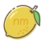

<!-- Generated from README.zh-CN.template.md. Do not edit README.zh-CN.md directly; run `deno task build`. -->

# 你好 👋

这里是  **[agou](https://github.com/agoudbg?ref=github)**。

我是一名**全栈开发者**，乐于参与**开源贡献**，希望我的工作能为你带来价值。

<!-- Predicted data: the ghvc counter was only enabled on 2026-08-07, so all earlier views are
     unknown. base=3700 back-fills a prediction of those historical views (~2 views/day over the
     ~1870 days since this profile README went live on 2021-06-24); the counter keeps tracking
     real views on top of it. Added zero width spaces to fix CJK width in badge. -->

## 我的组织

- 创建了  **[nmTeam](https://nm.team/?ref=github)**，将好用的产品推向世界。
- 创建了  **[安播空间](https://anbo.space/?ref=github)**，面向放送文化爱好者和电视迷提供实用工具。

## 我的产品

- 为 nmTeam 打造了  **[nmBot](https://nmteam.xyz/products/overview/nmBot-Telegram?ref=github)**，这款每月 **70 多万人**都在用的 Telegram 机器人可以帮你轻松管理群组和频道。
- :electron: **[Cosmosh](https://github.com/agoudbg/Cosmosh?ref=github)**，正在开发的跨平台桌面 SSH 客户端，兼顾超绝颜值和超强体验。
- 在我的  **[GitHub 账号](https://github.com/agoudbg?tab=repositories&q=&type=source&language=&sort=&ref=github)**，你还可以找到我的更多开源项目、工具和探索。

我以我的项目为荣，希望你也觉得好用。

## 技术栈

我熟悉以下技术和工具：

- 前端:

  

- 后端:

  

- 云服务与平台:

  

- 工具和编辑器:

  

## 社区贡献

- 我在  **[Telegram Info](https://tginfo.me/?ref=github)** 担任中文编辑/译者，致力于分享 Telegram 及其生态系统的最新动态。
- 我在为  **[grammY](https://grammy.dev/?ref=github)** 翻译文档，这是 1000 万星标以内最好的 Node.js/Deno Telegram 机器人框架。
- 我为开源项目做出自己的贡献，通过博客文章和教程与社区分享我的知识。

 

## 想了解更多？

- 访问我的个人网站：**[agou.im](https://agou.im/?ref=github)**
- 阅读我的博客：**[blog.agou.im](https://blog.agou.im/?ref=github)**
- 订阅我的 Telegram 频道：**[@bakadog](https://t.me/bakadog?ref=github)**

## 联系我

- 电子邮箱：**[agoudbg@gmail.com](mailto:agoudbg@gmail.com)**
- X (Twitter)：**[@agoudbg](https://x.com/agoudbg?ref=github)**

---

鸣谢 [skillicons.dev](https://skillicons.dev/?ref=github) 为本自述文件提供图标。
